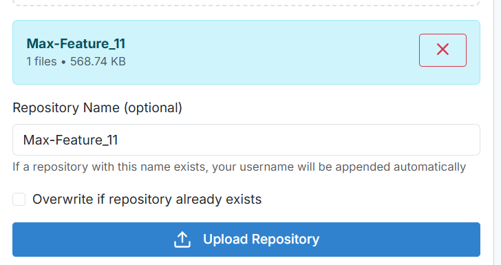

<style>
@import url('https://fonts.googleapis.com/css2?family=Inter:wght@300;400;500;600;700&display=swap');

body, .markdown-body {
  font-family: 'Inter', -apple-system, BlinkMacSystemFont, 'Segoe UI', Roboto, sans-serif !important;
  font-feature-settings: 'cv02', 'cv03', 'cv04', 'cv11';
  line-height: 1.6;
}

h1, h2, h3, h4, h5, h6 {
  font-family: 'Inter', sans-serif !important;
  font-weight: 600;
  letter-spacing: -0.025em;
}

code, pre {
  font-family: 'SF Mono', Monaco, 'Cascadia Code', 'Roboto Mono', Consolas, monospace !important;
}

.markdown-body {
  max-width: 900px;
  margin: 0 auto;
  padding: 2rem;
}

img {
  max-width: 100%;
  height: auto;
  border-radius: 6px;
  margin: 1rem 0;
}

table th {
  font-weight: 600;
  background-color: #f6f8fa;
}
</style>

# 📋 Gapteq DLC Management Platform Onboarding Guide
## Complete User Setup and Training Program


*Professional development platform training guide*

---

## 📋 Training Program Overview


*Complete this comprehensive training program in 7 structured modules*

### 🎯 **Learning Objectives**
By completing this training program, you will be able to:
- ✅ Navigate the DLC platform efficiently
- 📁 Create and manage repositories effectively  
- 🔄 Use Git version control systems
- 👥 Collaborate with team members seamlessly

**Estimated Training Duration:** 30-45 minutes  
**Skill Level:** Beginner  
**Prerequisites:** Basic computer literacy and web browser access

---

## 🚀 Module 1: Platform Access and User Registration
### *"Account Setup and Initial Platform Access"*


### 📋 **Platform Overview**
The Gapteq DLC Management platform provides:
- Centralized code repository management 🗂️
- Version control and change tracking 📊
- Team collaboration tools 👥
- Secure file access and editing 🔒

### 🔑 **Step 1: User Registration Process**

**Self-Service Account Creation:**

1. **🌐 Navigate to Platform URL**
   ```
   https://azeuw1dsenm02/GTDLC
   ```
2. **📝 Create Your Account**


   - Click "Register" or "Don't have an account? Register" link
   - Fill out the registration form:
     - **First Name**: Enter your first name
     - **Last Name**: Enter your last name  
     - **Email**: Enter your work email address
     - **Password**: Create a secure password (Number, Symbol,Letter , 12 characters min)
     - **Confirm Password**: Re-enter your password


   - Click "Create Account"

<!-- 3. **📧 Account Verification**
   - Check your email for a verification message
   - Click the verification link to activate your account
   - Your account is now ready to use -->

### 🔑 **Step 2: Platform Login Options**


*Platform login interface*

**Choose Your Login Method:**

1. **📧 Email/Password Login**
   - Enter your registered email address
   - Enter your password
   - Click "Sign In"

2. **🔐 Okta Single Sign-On (Enterprise)**

   - Enter your Okta username
   - Enter your Okta password  
   - Click "Sign in with Okta"
   - Alternative: Click "Prefer regular login? Sign in with email" to use email login

3. **🔒 First Login Setup**
   - Complete any additional security verification if required
   - Review and accept terms of use if prompted

### ✅ **Module 1 Complete: Platform Access Established**


**Verification:** You should now see the main dashboard with your personalized interface and available repositories.

---

## 🏠 Module 2: Dashboard Navigation and Interface Overview
### *"Platform Interface and Navigation Training"*


<!-- ### 🎯 **Dashboard Introduction**


*Main dashboard interface - centralized access to all platform features*

**The dashboard serves as your primary workspace.** Let's review the key interface components: -->

### 🔍 **Dashboard Layout and Features**

<!--  -->

**📊 Statistics Panel**

 
- **Repository Count**: Total number of projects in your workspace
- **File Count**: Aggregate file count across all projects  
- **Storage Usage**: Current storage utilization
- **Git Repositories**: Version-controlled project count

**📈 Activity Feed**

 
- **Recent Changes**: Latest modifications across projects
- **User Activity**: Files you've recently accessed or modified
- **Team Updates**: Collaborative changes from team members
- **Historical View**: Change history from the past 7 days

<!-- 
**🚀 Quick Access Panel**
- **Create Repository**: Initialize new project repositories
- **Browse Files**: Direct access to project file systems
- **Recent Repositories**: Frequently accessed projects for quick navigation -->

<!-- 
### 🎮 **Navigation Exercise: Interface Familiarization**


**Training Exercise:**
1. 👀 **Review** your current repository statistics
2. 🔍 **Locate** the activity feed section  
3. 🎯 **Click** on any recent change entry (if available)
4. 🏠 **Return** to the main dashboard using the home navigation -->


### ✅ **Module 2 : Sidebar Navigation**


**Best Practice:** 💡 The left sidebar navigation panel provides quick access to all platform sections and is your primary navigation tool.

- **Repositories**: A centralized section to manage all Git-related actions for repositories.
- **Repo Transfer**: Upload or download repositories between the local machine and the server. 
- **Promote**: Move repositories across different environments (e.g., from Dev to Test).
- **System Logs**:  Monitor all system-level logs related to user actions and operations
---

## 📁 Module 3: Repository Creation and Management
### *"Project Repository Setup and Configuration"*


### 📋 **Repository Fundamentals**

A repository is your **project's centralized workspace** - containing all files, version history, and collaboration features.


*A repository is a structured project container with version control capabilities*

### 🎯 **Exercise: Create Your First Repository**


**Step-by-Step Process:**

1. **🎯 Access Repository Management**
   <!--  -->
   - Click "Repositories" in the left navigation panel


2. **✨ Initialize New Repository**

   

   - Click the "New Repo" button
   
3. **🏷️ Configure Repository Name**

   ```
   Naming Convention: "project-name" or "team-project-name"
   Example: "user-management-system" or "documentation-updates"
   ```

   


4. **📝 Repository Type**

   ```
   Standard : Git Initialized Empty Repository (default)
   Extended : Non Git Empty Repository
   ```

<!-- 5. **🎁 Initialize with README File**
   - ✅ Check this option to create an initial documentation file
   
   

6. **🚀 Complete Repository Creation**
   
   - Click "Create Repository" to finalize setup -->

### ✅ **Repository Successfully Created**


### 📋 **Repository Copy Functionality**

Once you have created repositories, you can easily duplicate them using the platform's copy functionality. This feature allows you to create copies of existing repositories with various options for preserving Git history and handling existing destinations.

Note: Please  open this in gapteq once before copy functionality


*Repository copy functionality for duplicating projects*

#### 🎯 **Individual Repository Copy**

**Step-by-Step Copy Process:**

1. **🔍 Locate Repository to Copy**
   - Navigate to the "Repositories" section
   - Find the repository you want to duplicate in the repository list

2. **⚙️ Access Copy Options**

   

   - Click the three-dot menu (⋮) next to the repository name
   - Select "Copy" from the dropdown menu

3. **📝 Configure Copy Settings**
   
   
   **Copy Configuration Options:**
   - **New Repository Name**: Enter the name for the copied repository
     ```
     Example: "original-project" → "original-project_copy"
     ```
   - **Preserve Git History**: ✅ Keep complete version control history (recommended)
   - **Overwrite if Exists**: ✅ Replace destination if it already exists

4. **🚀 Execute Copy Operation**
   - Click "Copy" to start the duplication process
   - Monitor the progress notification
   - The copied repository will appear in your repository list


#### ✨ **Copy Operation Features**

**🔧 Advanced Copy Options:**

- **Git History Preservation**: Maintains complete commit history and branch structure
- **File System Copy**: Duplicates all files and folder structures
- **Database Integration**: Automatically registers copied repositories in the system
- **Conflict Resolution**: Handles naming conflicts and existing destinations
- **Progress Tracking**: Real-time feedback during copy operations

**📊 Copy Operation Benefits:**

- **Template Creation**: Use existing repositories as templates for new projects
- **Backup Creation**: Create working copies for experimentation
- **Environment Duplication**: Copy repositories between development environments
- **Team Distribution**: Share repository structures across team members


---

## 🌿 Module 4: Git Version Control System
### *"Version Control and Change Management Training"*

<!--  -->

### 🕰️ **Version Control Overview**

Git provides comprehensive version control capabilities, allowing you to track every change made to your project files with complete change history and rollback capabilities.


*Complete change tracking and version history management*

### 🎯 **Exercise: Create Your First Commit**

A **commit** represents a snapshot of your project at a specific point in time - similar to saving a checkpoint with detailed documentation.

**1. 📊 Review Git Status**


After adding / editing  your  file, you'll observe:
- **Modified Files**: Files with recent changes


- **Current Branch**: Active branch (typically "main" or "master") 


- **Staging Status**: Changes ready for commit


**2. 🔍 Understanding File Status Indicators**


- **🟡 Modified**: File has been changed since last commit
- **🟢 Staged**: Changes are prepared for the next commit
- **⚪ Untracked**: New files not yet under version control

**3. 📝 Write Descriptive Commit Message**


Follow professional commit message conventions:

```
✅ Effective Examples:
- "Update README with project documentation"
- "Add user authentication module" 
- "Fix database connection error"

❌ Avoid:
- "updates"
- "changes"
- "fix stuff"
```

**4. 🚀 Execute Your First Commit**


1. Enter descriptive commit message: "Listing for directories added"
2. Click the **"Commit"** button
3. Confirm the commit operation

### ✅ **Commit Successfully Created**


<!-- ### ✅ **Module 5 Complete: Version Control Competency Achieved** -->
<!--  -->

**Version Control Actions Completed:**
- ✅ Created permanent snapshot of project state
- ✅ Changes are now part of project history
- ✅ Rollback capability to this exact version established
- ✅ Change documentation for team collaboration

### 🔮 **Review Project History**

Access the **"Commit History"** tab to view project timeline. Each commit displays:
  - 📅 Timestamp of changes
  - 👤 Author information  
  - 💬 Commit message description
  - 🔍 Detailed change information

### 🌿 **Branch Management for Feature Development**

When working on new features, it's best practice to create separate branches to isolate your changes. This allows you to work independently without affecting the main codebase.

#### 🎯 **Creating and Managing Feature Branches**

**1. Create a New Branch**
   
   - Click on the "Branches" tab in your repository
   - Click "New Branch" button
   - Enter a descriptive branch name (e.g., "feature/user-authentication")
   - Click "Create Branch"

**2. Switch to Your Branch (Checkout)**
   
   - Select your newly created branch from the branch dropdown
   - The repository will switch to your feature branch
   - All changes you make will be isolated to this branch

**3. Make Changes and Commit**
   - Edit files as needed for your feature
   - Commit changes to your feature branch
   - Your commits will be tracked separately from the main branch

**4. Merge Your Feature**
   <!--  -->
   - Once your feature is complete, switch back to the main branch
   - Click "Merge" button
   - Select your feature branch to merge
   - Review changes and confirm merge
   - Your feature changes will be integrated into the main branch

#### 🔄 **Branch Workflow Best Practices**

- **Branch Naming**: Use descriptive names like "feature/", "bugfix/", or "hotfix/"
- **Regular Updates**: Pull changes from main branch to keep your feature branch up-to-date
- **Small, Focused Changes**: Create branches for specific features or fixes
- **Clean Merges**: Resolve any conflicts before merging to main branch

#### 🎮 **Exercise: Feature Branch Workflow**

**Practice Exercise:**
1. 🎯 **Create** a new feature branch
2. 🔄 **Checkout** to your feature branch
3. 📝 **Make** some changes and commit them
4. 🔀 **Merge** your changes back to main branch

This workflow helps maintain a clean, organized codebase while allowing multiple developers to work on different features simultaneously.

<!-- ### ✅ **Module 5 Complete: Version Control Competency Achieved** -->
<!--  -->

**Version Control Actions Completed:**
- ✅ Created permanent snapshot of project state
- ✅ Changes are now part of project history
- ✅ Rollback capability to this exact version established
- ✅ Change documentation for team collaboration

<!-- ### 🔮 **Review Project History** -->
<!--  -->

Access the **"Commit History"** tab to view project timeline. Each commit displays:
- 📅 Timestamp of changes
- 👤 Author information  
- 💬 Commit message description
- 🔍 Detailed change information

---

## 🔄 Module 5: Repository Transfer and Management
### *"Repository Import, Export, and Transfer Operations"*


### 📋 **Repository Transfer Overview**

The Repository Transfer functionality allows you to seamlessly move repositories between your local machine and the server, import external projects, and manage repository distribution across different environments. This powerful feature enables efficient project migration and backup operations.

### 🎯 **Repository Transfer Operations**

#### 📤 **Upload Repository to Server**

Transfer repositories from your local machine to the server for centralized management and team collaboration.

**Step-by-Step Upload Process:**

1. **🎯 Access Repository Transfer**
   
   - Navigate to "Repo Transfer" in the left sidebar
   - Click "Upload Repository" or "Add Repository to Server"

2. **📁 Select Local Repository**
   
   - Browse and select the repository folder from your local machine
   - The system will scan the selected directory for repository structure

3. **🏷️ Configure Repository Name**
   
   - Review the detected repository name
   - Modify the name if needed to follow naming conventions
   - Ensure the name doesn't conflict with existing repositories

4. **🚀 Upload and Monitor Progress**
   
   - Click "Upload" to start the transfer process
   - Monitor the real-time progress indicator
   - Large repositories may take several minutes to complete

#### 📥 **Download Repository from Server**

Download repositories from the server to your local machine for offline development or backup purposes.

**Step-by-Step Download Process:**

1. **🔍 Select Repository to Download**
   
   - Choose the repository you want to download from the server list
   - Review repository details and size information

2. **📂 Choose Local Destination**
   - Select the local directory where you want to save the repository
   - Ensure sufficient disk space is available

3. **⬇️ Execute Download**
   - Click "Download" to start the transfer
   - Monitor download progress and completion status

#### 📊 **Transfer History and Tracking**

Keep track of all repository transfer operations for audit and management purposes.


**Transfer Tracking Features:**
- **Recent Transfers**: View latest upload and download operations
- **Transfer Status**: Monitor ongoing operations and completion status
- **Transfer History**: Complete log of all repository movements
- **Error Reporting**: Detailed information about failed transfers

### ✨ **Repository Transfer Features**

**🔧 Advanced Transfer Capabilities:**

- **Git History Preservation**: Maintains complete version control history during transfers
- **Large File Support**: Handles repositories with large files and extensive history
- **Incremental Transfers**: Only transfers changed files for efficiency
- **Compression**: Automatic compression during transfer to reduce bandwidth usage
- **Integrity Verification**: Ensures data integrity during transfer operations


**📊 Transfer Operation Benefits:**

- **Centralized Management**: Store repositories on the server for team access
- **Backup and Recovery**: Create local backups of important repositories
- **Environment Migration**: Move repositories between development environments
- **Offline Development**: Download repositories for offline work
- **Team Distribution**: Share repositories across team members efficiently

### 🎮 **Exercise: Repository Transfer Workflow**

**Training Exercise:**
1. 🎯 **Upload** a local repository to the server
2. 📝 **Verify** the repository appears in your server repository list
3. ⬇️ **Download** the repository to a different local location
4. ✅ **Confirm** both local and server copies are identical

### ✅ **Repository Transfer Mastery Achieved**

<!--  -->

**Transfer Operations Completed:**
- ✅ Repository upload to server
- ✅ Repository download from server
- ✅ Transfer progress monitoring
- ✅ Transfer history tracking

**Best Practices for Repository Transfers:**
- 📝 **Clear Naming**: Use descriptive names for uploaded repositories
- 🔄 **Regular Backups**: Download important repositories regularly
- 📊 **Monitor Progress**: Watch transfer progress for large repositories
- 🔒 **Verify Integrity**: Check repository integrity after transfers

---

## 🚀 Module 6: Environment Promotion and Deployment
### *"Repository Promotion Between Environments"*


### 📋 **Environment Promotion Overview**

The Environment Promotion feature enables structured deployment of repositories between different environments (Development, UAT, Production). This controlled workflow ensures safe and auditable deployment processes with comprehensive tracking and validation.

### 🎯 **Promotion Workflow Process**

The promotion process follows a structured wizard-based approach to ensure accuracy and prevent deployment errors.

#### **Step 1: Select Source Environment and Repository**


**Source Selection Process:**
- **Source Environment**: Choose the environment to promote from (typically Development)
- **Repository Selection**: Select the specific repository or folder to promote
- **File Selection**: Choose individual files or entire repository contents
- **Validation**: Manual Typing Enables User to Correctly Provide Correct Repo (accidental selection prevention)

#### **Step 2: Choose Destination Environment**


**Destination Configuration:**
- **Target Environment**: Select destination environment (UAT, Production, etc.)
- **Environment Validation**: System checks destination environment availability
<!-- - **Conflict Detection**: Identifies potential conflicts with existing content
- **Permission Verification**: Confirms deployment permissions for target environment -->

#### **Step 3: Review and Validate Promotion Details**


**Review Process:**
- **Source Summary**: Review selected source environment and content
- **Destination Summary**: Confirm target environment and deployment path
- **Change Impact**: Preview changes that will be applied
- **Validation Results**: Review any warnings or conflicts detected

#### **Step 4: Execute Promotion**


**Execution Phase:**
- **Final Confirmation**: Click "Finish" button to start promotion process
- **Progress Monitoring**: Real-time progress tracking during deployment
<!-- - **Error Handling**: Automatic rollback on critical errors -->
- **Status Updates**: Continuous feedback during promotion execution

#### **Step 5: Promotion Completion**


**Completion Verification:**
- **Success Confirmation**: Verification of successful deployment
- **Deployment Summary**: Complete report of promoted content
- **Audit Trail**: Automatic logging of promotion activity
- **Post-Deployment Validation**: Optional verification of deployed content

### ✨ **Promotion Features**

**🔧 Advanced Promotion Capabilities:**

- **Environment Promotion**: Structured deployment between environments
- **Release Management**: Controlled deployment workflows
- **Approval Processes**: Multi-stage approval for critical changes
- **Audit Trail**: Complete deployment history for compliance
- **Rollback Support**: Ability to revert deployments if needed
<!-- - **Conflict Resolution**: Automated handling of deployment conflicts -->

**📊 Promotion Benefits:**

- **Controlled Deployments**: Structured approach to environment promotion
<!-- - **Risk Mitigation**: Validation and approval processes reduce deployment risks -->
- **Compliance**: Complete audit trail for regulatory requirements
- **Efficiency**: Automated promotion reduces manual deployment errors

### 🎮 **Exercise: Environment Promotion Workflow**

**Training Exercise:**
1. 🎯 **Select** a repository from Development environment
2. 🔄 **Configure** promotion to UAT environment
3. 📝 **Review** promotion details and validation results
4. 🚀 **Execute** promotion and monitor progress
5. ✅ **Verify** successful deployment in target environment

### ✅ **Environment Promotion Mastery Achieved**

**Promotion Operations Completed:**
- ✅ Source environment and repository selection
- ✅ Destination environment configuration
- ✅ Promotion review and validation
- ✅ Successful promotion execution
- ✅ Deployment verification and audit trail

---

## 📊 Module 7: System Monitoring and Logs
### *"Comprehensive System Monitoring and Activity Tracking"*


### 📋 **System Monitoring Overview**

The System Logs feature provides comprehensive monitoring and tracking of all operations across the application. This centralized monitoring system offers real-time insights into system performance, user activities, and operational metrics with advanced filtering and analysis capabilities.

### 🎯 **System Monitoring Features**

#### **📈 Dashboard Overview and Statistics**


**Key Metrics and Statistics:**
- **Operation Count**: Total number of system operations performed
- **User Activity**: Active user sessions and recent activities
- **System Performance**: Response times and system health metrics
- **Error Tracking**: Count and categorization of system errors
- **Resource Usage**: Server resources and storage utilization

#### **🔍 Advanced Filtering and Search**


**Comprehensive Filtering Options:**
- **Date Range**: Filter logs by specific time periods
- **Operation Type**: Filter by specific operations (Git, Repository, User actions)
- **User Filter**: View activities by specific users
- **Severity Level**: Filter by log levels (Info, Warning, Error, Critical)
- **Component Filter**: Filter by system components or modules
- **Custom Search**: Text-based search across log messages

### ✨ **System Monitoring Capabilities**

**🔧 Advanced Monitoring Features:**

- **Real-time Monitoring**: Live tracking of system operations and performance
- **Historical Analysis**: Comprehensive historical data for trend analysis
- **Alert System**: Automated alerts for critical system events
- **Performance Metrics**: Detailed performance monitoring and optimization insights
- **Audit Compliance**: Complete audit trail for compliance and security requirements
- **Export Functionality**: Export logs and reports for external analysis

**📊 Monitoring Benefits:**

- **Operational Visibility**: Complete visibility into system operations and user activities
- **Performance Optimization**: Identify bottlenecks and optimization opportunities
- **Security Monitoring**: Track security-related events and potential threats
- **Troubleshooting**: Rapid identification and resolution of system issues
- **Compliance Reporting**: Generate reports for audit and compliance requirements

### 🎮 **Exercise: System Monitoring Workflow**

**Training Exercise:**
1. 🎯 **Explore** the system logs dashboard and statistics tiles
2. 🔍 **Apply** various filters to narrow down log entries
3. 📊 **Analyze** system performance metrics and trends
4. 🔎 **Search** for specific operations or user activities
5. 📈 **Generate** reports for specific time periods or operations

### ✅ **System Monitoring Mastery Achieved**

**Monitoring Operations Completed:**
- ✅ Dashboard navigation and statistics review
- ✅ Advanced filtering and search capabilities
- ✅ Performance metrics analysis
- ✅ Log analysis and troubleshooting
- ✅ Report generation and export functionality

---

## 📁 Module 8: Repository File Management and Navigation
### *"Web-Based File System Navigation and Management"*

### 📋 **Repository File Structure Overview**

The platform provides comprehensive web-based file system navigation that allows you to explore, manage, and monitor repository contents directly through your browser. This feature offers real-time insights into repository structure, file status, and recent changes.

### 🎯 **Accessing Repository File Structure**

#### **Opening Repository File Browser**


**Access Process:**
1. **Navigate to Repositories**: Go to the main repositories section
2. **Select Repository**: Choose the repository you want to explore
3. **Click "Open"**: Click the "Open" button (second option) next to the repository name
4. **File Browser Launch**: The web-based file browser will open in a new interface

#### **Repository File Structure Interface**


**File Browser Features:**
- **Directory Tree**: Hierarchical view of all folders and files
- **File Details**: File sizes, modification dates, and file types
- **Navigation Breadcrumbs**: Easy navigation through folder hierarchy
- **Quick Actions**: Direct access to file operations and editing

#### **Repository Status Monitoring**


**Status Information Display:**
- **Database Status**: Current synchronization state between database and file system
- **Git Status**: Clean or modified state of the repository
- **File Changes**: Indicators for modified, added, or deleted files
- **Sync Status**: Real-time synchronization status with the server

#### **Recent Changes Tracking**


**Change Tracking Features:**
- **Recent Modifications**: List of recently changed files in the repository
- **Change Timeline**: Chronological view of file modifications
- **User Activity**: Track who made changes and when
- **Change Details**: Specific information about file modifications

### ✨ **File Management Capabilities**

**🔧 Advanced File Operations:**

<!-- - **File Editing**: Direct in-browser editing of text files and code
- **File Upload**: Drag-and-drop file uploads to repository folders
- **Folder Creation**: Create new directories within the repository structure
- **File Download**: Download individual files or entire folders
- **File Deletion**: Remove files and folders with confirmation prompts
- **File Renaming**: Rename files and folders directly in the interface -->

**📊 File Management Benefits:**

- **Web-Based Access**: No need for local Git clients or file system access
- **Real-Time Updates**: Immediate reflection of changes across the platform
<!-- - **Collaborative Editing**: Multiple users can work on the same repository -->
- **Version Control Integration**: All changes are automatically tracked in Git

---

## ⚙️ Module 9: Platform Best Practices and Common Functionalities
### *"Essential Platform Guidelines and Operational Tips"*

### 📋 **Platform Performance and Navigation Guidelines**

Understanding these common functionalities and best practices will ensure optimal platform performance and user experience.

### 🎯 **Essential Platform Operations**

#### **1. 🔄 Refresh and Response Management**

**Performance Optimization Guidelines:**
- **Response Time Awareness**: If any function is unresponsive for 35-60 seconds, use the refresh button
- **Page-Level Refresh**: Use the refresh button available on the specific page, not the browser refresh
- **Operation Timeout**: Allow sufficient time for large operations to complete
- **Progress Monitoring**: Watch for progress indicators during long-running operations

**When to Use Refresh:**
- Repository operations taking longer than expected
- File uploads or downloads that appear stalled
- Git operations that seem unresponsive
- Data loading that exceeds normal timeframes

#### **2. 🔄 Sync Functionality - Critical Platform Feature**

**Sync Operation Overview:**
- **Purpose**: Synchronizes folder structure on disk with the database
- **Importance**: Ensures data consistency between file system and database
- **Frequency**: Should be performed regularly, especially after bulk operations
- **Automatic Triggers**: Some operations automatically trigger sync processes

**When to Use Sync:**
- After uploading multiple repositories
- When file system and database appear out of sync
- Following bulk copy or delete operations
- If repository listings appear incomplete or outdated

**Sync Best Practices:**
- Allow sync operations to complete fully before starting new operations
- Monitor sync progress through the interface
- Use sync after major repository changes
- Regular sync helps maintain platform performance

#### **3. 🧭 Single Page Application (SPA) Navigation Guidelines**

**Navigation Best Practices:**
- **Tab Switching**: Wait for data to load completely when moving between tabs
- **Large Data Sets**: Allow extra time for pages with extensive data
- **Active Tab Verification**: Ensure the correct tab is active before proceeding
- **Data Loading**: Wait for loading indicators to complete

**Recommended Navigation Workflow:**
1. **Navigate to Target Tab**: Click on the desired navigation tab
2. **Wait for Data Load**: Allow the page to fully load data
3. **Verify Active State**: Confirm the correct tab is highlighted/active
4. **Proceed with Operations**: Begin your intended operations

**Avoiding Navigation Issues:**
- Don't rapidly switch between tabs while data is loading
- Wait for loading spinners or progress indicators to complete
- If data appears incorrect, navigate away and return to refresh the view
- Use browser back/forward buttons sparingly in the SPA environment

### ✨ **Platform Optimization Tips**

**🔧 Performance Enhancement:**

- **Batch Operations**: Group similar operations together for efficiency
- **Regular Maintenance**: Use sync functionality to maintain data consistency
- **Patience with Large Operations**: Allow time for complex operations to complete
- **Proper Navigation**: Follow SPA navigation guidelines for best experience

**📊 User Experience Benefits:**

- **Consistent Performance**: Following guidelines ensures reliable platform behavior
- **Data Integrity**: Proper sync usage maintains accurate data representation
- **Smooth Navigation**: SPA best practices provide seamless user experience
- **Reduced Errors**: Patience with operations prevents timeout and error conditions

### 🎮 **Exercise: Platform Best Practices**

**Training Exercise:**
1. 🎯 **Practice** proper tab navigation with data loading awareness
2. 🔄 **Execute** a sync operation and monitor its completion
3. 📊 **Test** refresh functionality during a long-running operation
4. 🧭 **Navigate** between different platform sections following SPA guidelines

### ✅ **Platform Best Practices Mastery Achieved**

**Best Practices Completed:**
- ✅ Refresh and response management understanding
- ✅ Sync functionality importance and usage
- ✅ SPA navigation guidelines implementation
- ✅ Performance optimization awareness

---

## 📚 Reference Documentation and Support

<!--  -->

**Professional Resources:**
- 📖 [Complete User Documentation](COMPLETE_USER_DOCUMENTATION.md)
- 🆘 [Technical Support and Troubleshooting](#troubleshooting--support)
- 💡 [Best Practices Guide](#best-practices)
- 🎯 [Frequently Asked Questions](#frequently-asked-questions-faq)
